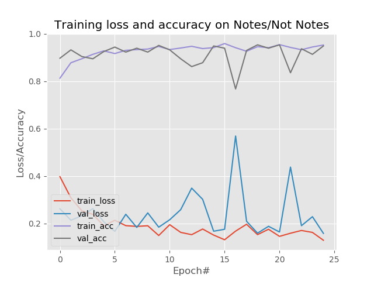

# Exam-Notes-Sorter

At the time of exams most of the time student share their notes via social media & after the exam gets over; it becomes really difficut to sort all those images manually. So this system counters this problem by detecting exam notes (pictures which are clicked from mobile camera) and sorts it according to the folders.

## Getting Started

### Dataset

The dataset sample can be seen in the `images` folder i.e. organisation of images for training.

For training on custom data, follow the steps:
- Sort images according to the images folder.
- Run `$ python train_network.py` for training on those custom images.

[examples](https://github.com/smit-sms/Exam-Notes-Sorter/tree/main/examples) directory contains some example images for testing purposes.

### Installation

1. [Download](https://github.com/smit-sms/Exam-Notes-Sorter/archive/refs/heads/main.zip) or Clone the project to your computer by using `git clone https://github.com/smit-sms/Exam-Notes-Sorter.git` on your terminal.

2. Run `$ pip3 install -r requirements.txt ` to install all the required libraries.

3. Run `$ python app.py` to see the project in action.

## Training

## Demo

[Click here to watch](https://github.com/smit-sms/Exam-Notes-Sorter/blob/main/LICENSE)

## License

[MIT License](https://github.com/smit-sms/Exam-Notes-Sorter/blob/main/LICENSE)